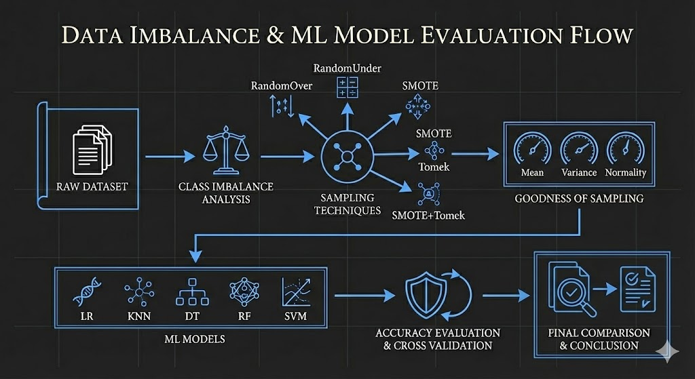
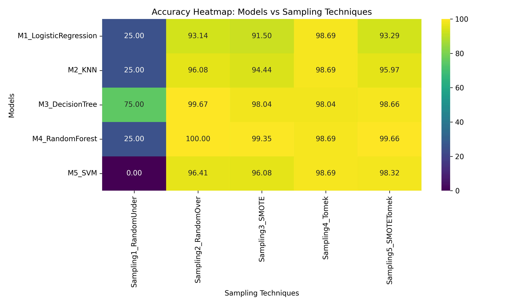
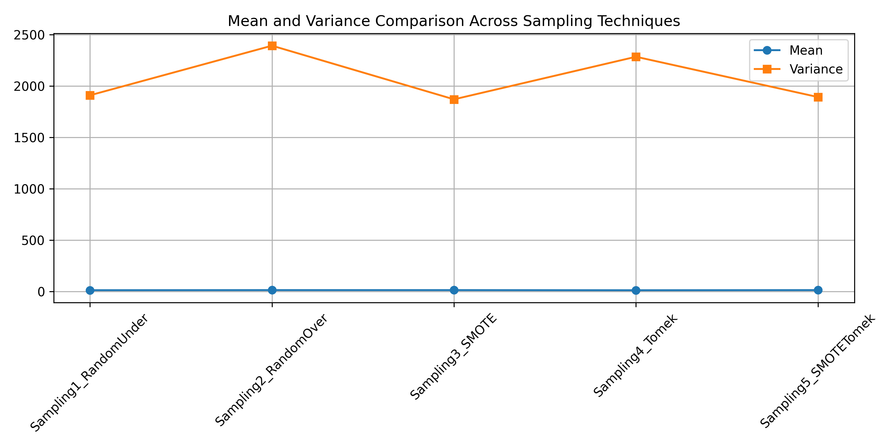
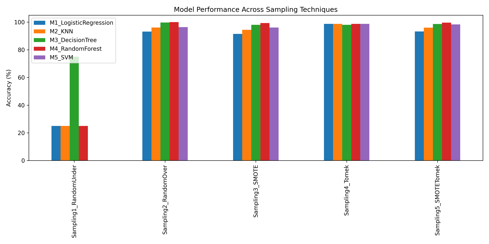
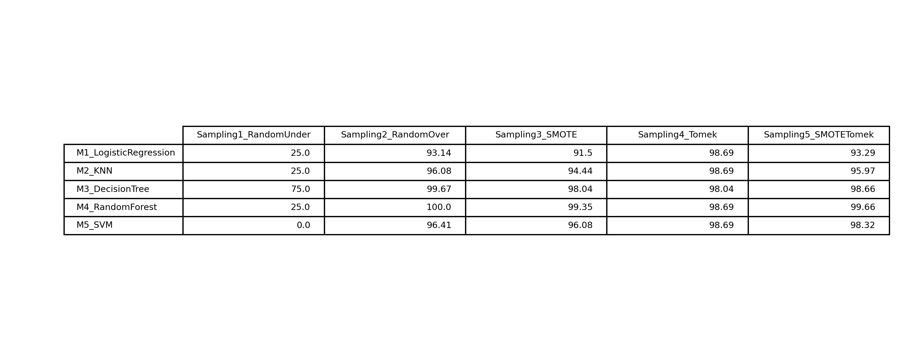

#  Sampling Techniques for Imbalanced Credit Card Dataset

##  Problem Statement
In real-world applications such as credit card fraud detection, datasets are often highly imbalanced. This imbalance can significantly bias machine learning models toward the majority class, resulting in misleading performance metrics.

The objective of this assignment is to apply different sampling techniques to address class imbalance and analyze how these techniques influence the accuracy of multiple machine learning models.

---

##  Dataset Description
- **Dataset:** Credit Card Transactions  
- **Total Samples:** 772  
- **Features:** 30 (`Time`, `Amount`, `V1–V28`)  
- **Target Variable:** `Class`  
  - `0` → Non-Fraud  
  - `1` → Fraud  

Only **9 out of 772 transactions** are fraudulent, making the dataset **highly imbalanced** and unsuitable for direct model training without sampling.

---

##  Methodology Overview
The complete workflow followed in this project is illustrated below.  
It visually represents how the raw imbalanced dataset is processed through sampling techniques, evaluated for statistical quality, and used to train multiple machine learning models before final comparison.



### Workflow Summary
1. The raw dataset is analyzed to understand the degree of class imbalance.  
2. Multiple sampling techniques are applied to address imbalance.  
3. Statistical measures are used to evaluate the quality of the generated samples.  
4. Five machine learning models are trained on each sampled dataset.  
5. Model performance is evaluated using accuracy and cross-validation.  
6. Final results are compared to identify the most effective model–sampling combination.

---

##  Sampling Techniques Used
The following five sampling techniques were applied:

1. **Random Under Sampling**  
2. **Random Over Sampling**  
3. **SMOTE (Synthetic Minority Over-sampling Technique)**  
4. **Tomek Links**  
5. **SMOTE + Tomek Links**

Each technique was applied to address class imbalance **either by balancing the dataset or by cleaning ambiguous boundary samples** (in the case of Tomek Links).

---

##  Goodness of Sampling Analysis
To verify whether the generated samples are representative of the original dataset, the following statistical measures were used:

### Central Tendency
- Mean  
- Median  
- Mode  

### Dispersion
- Range  
- Variance  
- Standard Deviation  

### Normality Test
- Shapiro–Wilk Test  

The analysis showed that **SMOTE and SMOTE–Tomek** preserve central tendency and control variance more effectively, while **Random Under Sampling** leads to instability due to excessive data removal. Tomek Links primarily act as a data-cleaning technique rather than a balancing method.

---

##  Machine Learning Models Used
Five different machine learning models were trained on each sampled dataset:

- **M1:** Logistic Regression  
- **M2:** K-Nearest Neighbors (KNN)  
- **M3:** Decision Tree  
- **M4:** Random Forest  
- **M5:** Support Vector Machine (SVM)  

---

##  Results

| Model | RandomUnder | RandomOver | SMOTE | Tomek | SMOTE+Tomek |
|-----|------------|-----------|------|------|------------|
| Logistic Regression | 25.00 | 93.14 | 91.50 | 98.69 | 93.29 |
| KNN | 25.00 | 96.08 | 94.44 | 98.69 | 95.97 |
| Decision Tree | 75.00 | 99.67 | 98.04 | 98.04 | 98.66 |
| Random Forest | 25.00 | 100.00 | 99.35 | 98.69 | 99.66 |
| SVM | 0.00 | 96.41 | 96.08 | 98.69 | 98.32 |

---

##  Results Visualization

### Accuracy Heatmap


This heatmap illustrates the accuracy of each machine learning model across different sampling techniques.

---

### Mean and Variance Comparison


This plot compares the central tendency and dispersion of datasets generated by different sampling techniques.

---

### Model-wise Accuracy Comparison


This bar chart shows how different models perform under each sampling strategy.

---

### Final Accuracy Table
For improved readability and quick interpretation, the final accuracy table is also presented visually below.



---

##  Discussion
- Random Under Sampling resulted in poor performance due to significant information loss.
- Random Over Sampling achieved very high accuracy but showed signs of overfitting due to duplicated samples.
- SMOTE and SMOTE–Tomek provided a better balance between bias reduction and variance control.
- Tomek Links improved class separability by removing ambiguous boundary samples.

A **5-fold cross-validation** on the best-performing model yielded an average accuracy of approximately **98.9%**, confirming strong generalization with mild overfitting.

---

##  Conclusion
Sampling techniques significantly influence model performance on imbalanced datasets. While Random Over Sampling achieved the highest accuracy, SMOTE-based methods offered more stable and generalizable results. The choice of sampling technique should depend on the model type and the desired balance between performance and robustness.

---

##  Note
Accuracy alone may not be sufficient for evaluating imbalanced datasets. In real-world applications, metrics such as **precision, recall, and F1-score** are more appropriate for assessing minority-class performance.

---

##  Project Folder Structure

```bash
Sampling-Assignment/
│
├── data/
│ └── Creditcard_data.csv
│
├── notebooks/
│ └── sampling_analysis.ipynb
│
├── results/
│ ├── methodology_workflow.png
│ ├── accuracy_heatmap.png
│ ├── mean_variance_comparison.png
│ ├── model_sampling_comparison.png
│ └── accuracy_table.png
│
├── README.md
└── requirements.txt
```

---

##  Author
**Khushnoor Kaur**  
Roll No: 102303219
